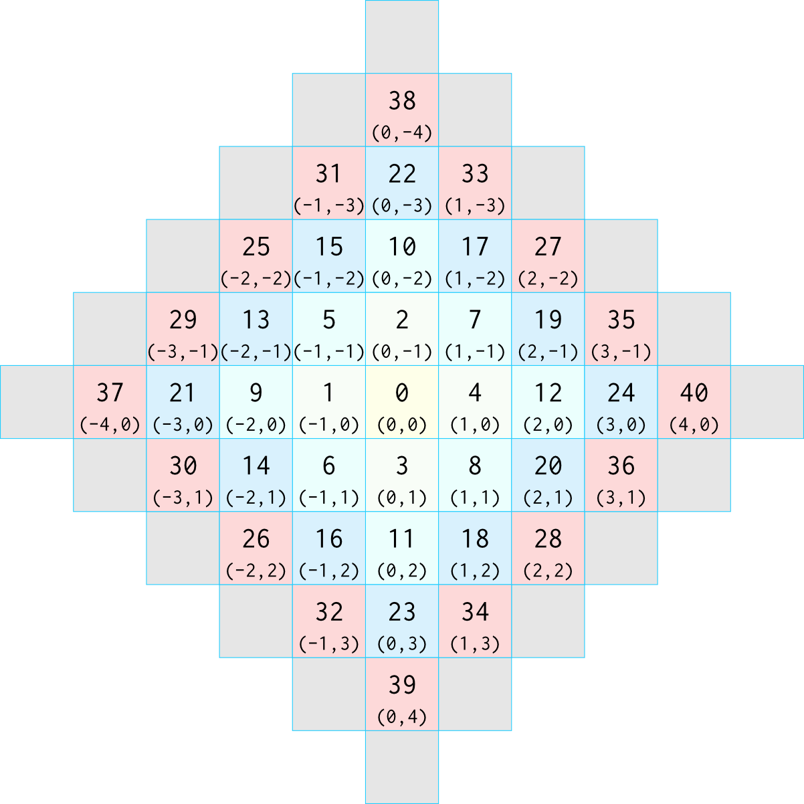

# MFM Core Components

## The Event Window

## Element

An Element is the main programmable component of the Movable Feast Machine, acting much like a class in an object-oriented language. An Atom contains a Type number which links that atom to its associated Element, which describes its behavior and other properties.

## Atom

An Atom is the fundamental representation of state in the Movable Feast Machine, in some ways analogous to an object in an object-oriented language. Each site is occupied by exactly one atom at all times (because even empty is considered a kind of Atom). An Atom has a type number that links it to the element of which it is an instance. In addition to its type number, each an Atom possesses a very small amount of mutable storage (on the order of a few dozens of bits perhaps) which may be defined as desired by the element and modified during an event.

## Site

A Site is a unit of digital storage capable of representing one atom (possibly with some fixed amount of additional storage). Each tile contains an array of sites, each of which holds exactly one atom at all times.

## Tile

A Tile is a digital computing hardware device (or simulation thereof) capable of performing computations and communicating with other nearby Tiles. Each Tile possesses volatile memory capable of representing a finite array of sites, each of which can contain one atom, as well as non-volatile memory capable of storing the executable code that defines the behavior of the atoms based on their element type.

## Grid

A Grid is a spatial configuration of (possibly many) tiles, defining the connectivity between the tiles. Although, in simulation, the grid is usually fixed in size, the individual tiles within a grid may be active or not, and MFM computations are esteemed if they can survive and progress under a range of grid sizes and configurations.